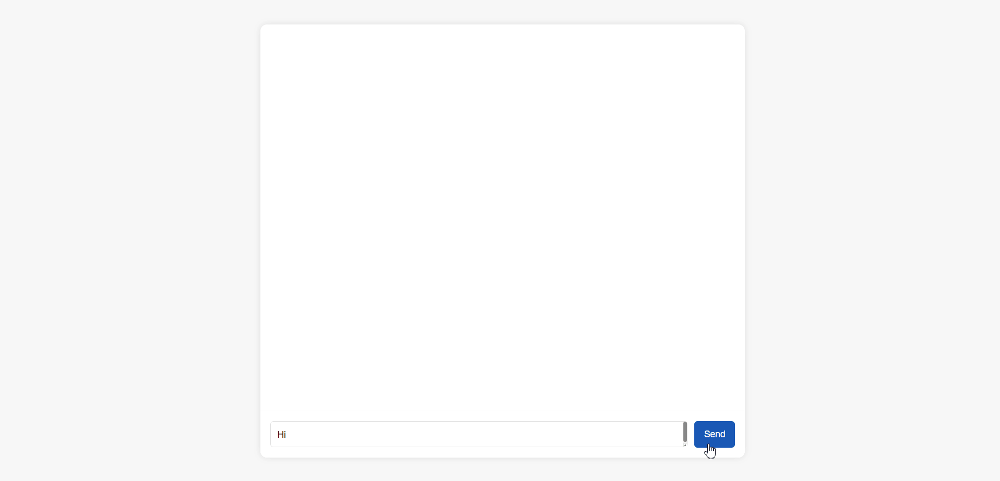
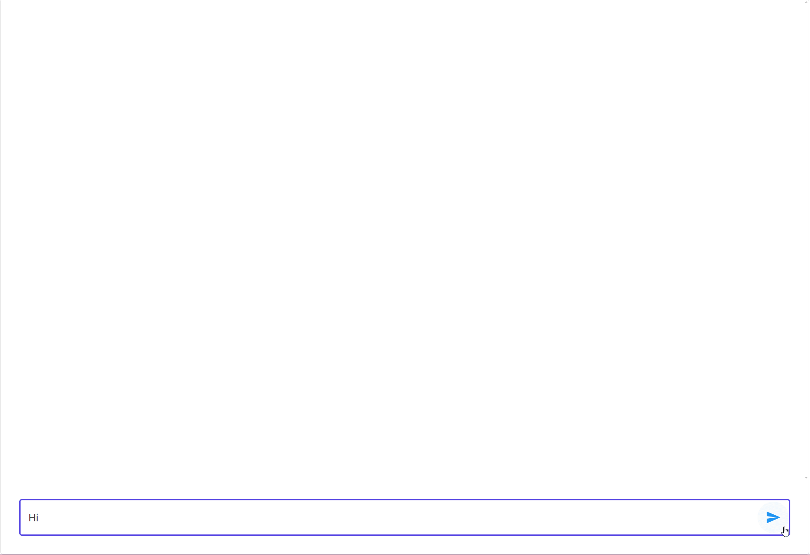

# Blazor chatbot with OpenAI

A simple chatbot with a Blazor UI using OpenAI. The chatbot allows the user to ask questions to an OpenAI model and receive an answer.
There are two options within this code sample (styling), a custom css version (Chatbot.razor) and a MudBlazor version (BlazorChatbot).

## Custom CSS example



[//]: # ()

## MudBlazor 



[//]: # ()

# Installation

1. Clone the repo `https://github.com/rachkeenan/sample-ai-chatbot-blazor.git`

## Pre-requisites

- Visual Studio or Visual Studio Code
- OpenAI key (set the environment variable on your computer)
	- To set the environment variable using the CLI
		1. Open the command prompt as administration	
		2. `setx VARIABLE_NAME "YourValue"` 
			- `setx OPENAI_API_KEY "xxxxxxxxxxxxxxxx"`
- Run the app

### Custom CSS

For the custom CSS version uncomment the following lines in the App.razor:

``` html
<link rel="stylesheet" href="app.css"/>
<Chatbot @rendermode="InteractiveServer" />
```

And comment out this line for the MudBlazor frontend

``` html
<Chatbot @rendermode="InteractiveServer" />
```

### MudBlazor

For the MudBlazor version these lines must be uncommented in the App.razor:

``` html
<link href="_content/MudBlazor/MudBlazor.min.css" rel="stylesheet"/>
<Chatbot @rendermode="InteractiveServer" />
<script src="_content/MudBlazor/MudBlazor.min.js"></script>
```

And comment out:

``` html
<link rel="stylesheet" href="app.css"/>
<Chatbot @rendermode="InteractiveServer" />
```

## References used

- https://www.youtube.com/watch?v=z7V-_JVF_Zo&t=662s
- ChatGPT
- https://mudblazor.com/
- https://github.com/codingwithtom1/blazorcopilot1/blob/main/Components/Chat.razor
