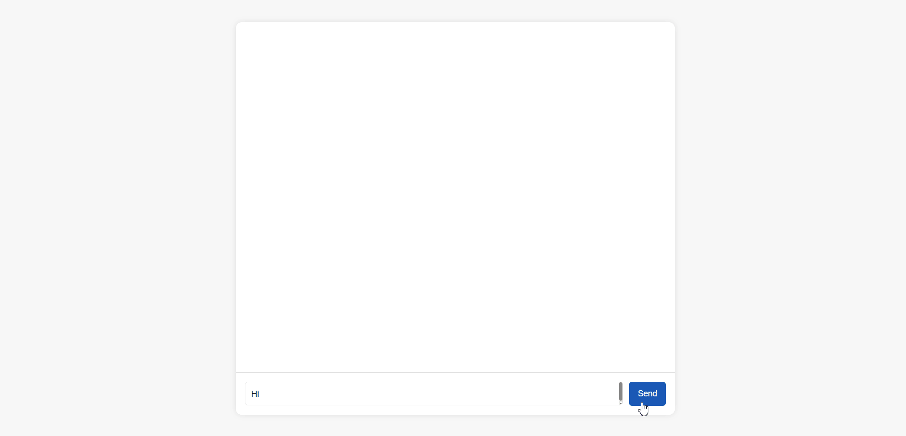

# Blazor chatbot with OpenAI

A simple chatbot with a Blazor UI using OpenAI. The chatbot allows the user to ask questions to an OpenAI model and receive an answer.

# Installation
1. Clone the repo

## Pre-requisites
- Visual Studio or Visual Studio Code
- OpenAI key (set the environment variable on your computer)
	- To set the environment variable using the CLI
		1. Open the command prompt as administration	
		2. `setx VARIABLE_NAME "YourValue"` 
			- `setx OPENAI_API_KEY "xxxxxxxxxxxxxxxx"`
- Run the app

## References used
- https://www.youtube.com/watch?v=z7V-_JVF_Zo&t=662s&pp=ygUMQUkgYmxhem9yIGFw
- ChatGPT